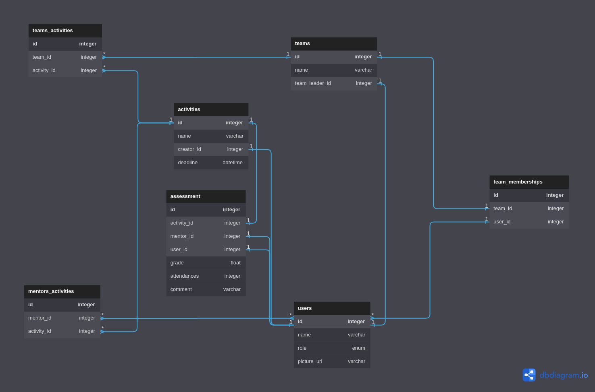

# SOLID Internship Tool Backend
For the backend of our internship management application created for IBM Summer Practice 2023

### API Documentation
Swagger DOCS: `http://localhost:8080/swagger-ui/index.html`

### UI Template
Figma Design Template: [LINK](https://www.figma.com/file/i1wrxtrDeNn5TGDR7Lyhaa/Internship-logischool?type=design&node-id=0-1&mode=design&t=O9ATh5imoh8HVkZL-0)

### Entity Diagram

